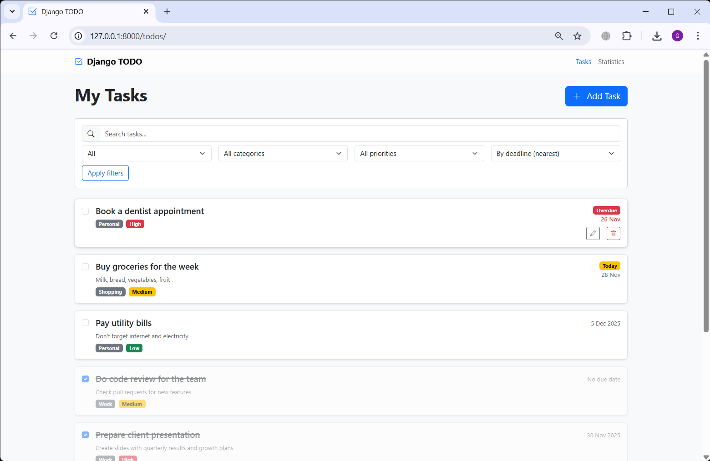
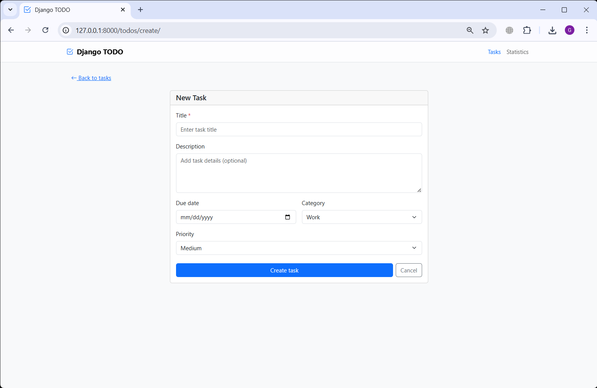
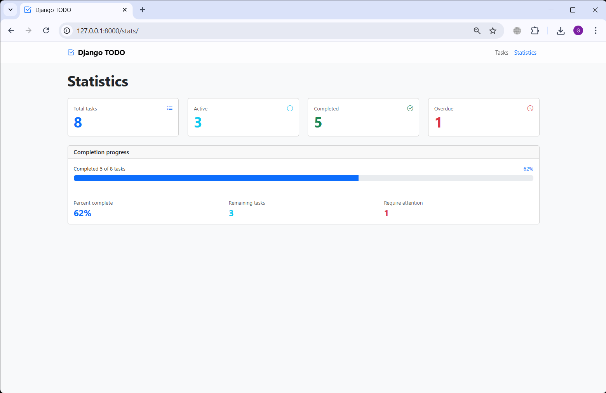

# Django Todo

A simple Todo web application built with Django and Bootstrap 5.

## Features

- Create, edit, delete tasks
- Mark tasks as completed; completed tasks are listed last
- Due dates with "Today" and "Overdue" badges
- Categories and priority labels
- Search, filter by status/category/priority, and sort by deadline/priority
- Statistics dashboard
- Subtle glass header, action icons on hover, and consistent favicon

## Screenshots
<a href="doc/imgs/Django-TODO_img1.png" target="_blank">
  
</a>
<a href="doc/imgs/Django-TODO_img2.png" target="_blank">
  
</a>
<a href="doc/imgs/Django-TODO_img3.png" target="_blank">
  
</a>

## Tech Stack

- Django
- Bootstrap 5 + Bootstrap Icons
- SQLite (default)

## Getting Started

### Prerequisites

- Python 3.10+
- Either `uv` or `pip` for dependency management

### Quick Start

```
cd backend

# Install Django (choose one)
uv pip install django
# or
pip install django

# Apply migrations and seed demo data
uv run python manage.py migrate
uv run python manage.py seed_todos --force

# Start the development server
uv run python manage.py runserver
```

If you use `pip`, you can replace `uv run` with `python`:

```
python manage.py migrate
python manage.py seed_todos --force
python manage.py runserver
```

### URLs

- `http://localhost:8000/todos/` — Task list and CRUD
- `http://localhost:8000/stats/` — Statistics dashboard

## Testing

```
uv run python manage.py test
```

## Project Structure

- `backend/django_todo/settings.py` — Django settings
- `backend/tasks/models.py` — Todo model
- `backend/tasks/views.py` — Views and business logic
- `backend/tasks/forms.py` — Forms
- `backend/tasks/templates/tasks/*.html` — Templates
- `backend/tasks/management/commands/seed_todos.py` — Demo data seeding command

## Seed Demo Data

Create demo tasks matching the app's UI:

```
uv run python manage.py seed_todos
# overwrite existing tasks
uv run python manage.py seed_todos --force
```

## Notes

- Uses SQLite by default; adjust `DATABASES` in `settings.py` for production.
- Set `DEBUG=False` and configure `ALLOWED_HOSTS` before deploying.

## Acknowledgements

Thanks to DataTalks.Club for open-source learning framework: 
* https://github.com/DataTalksClub/ai-dev-tools-zoomcamp
