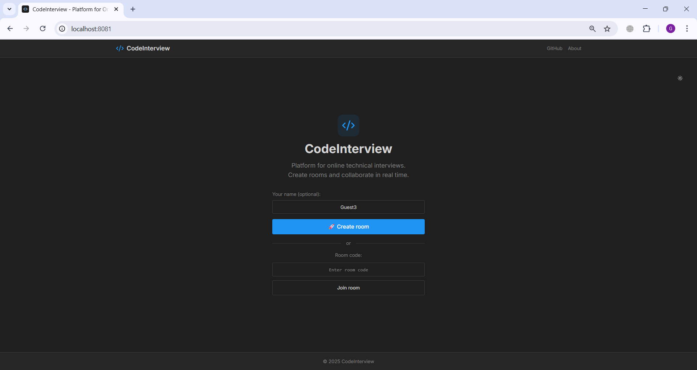
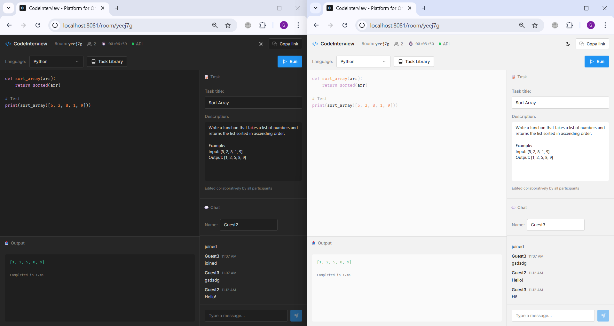
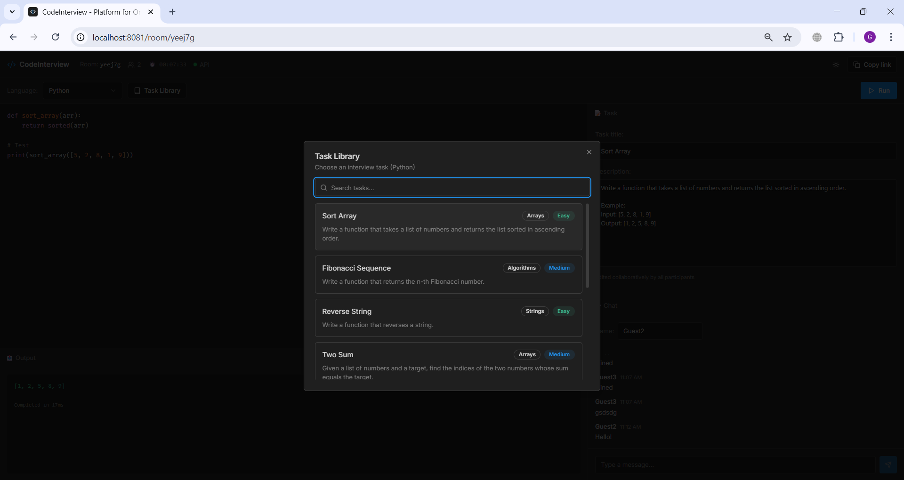
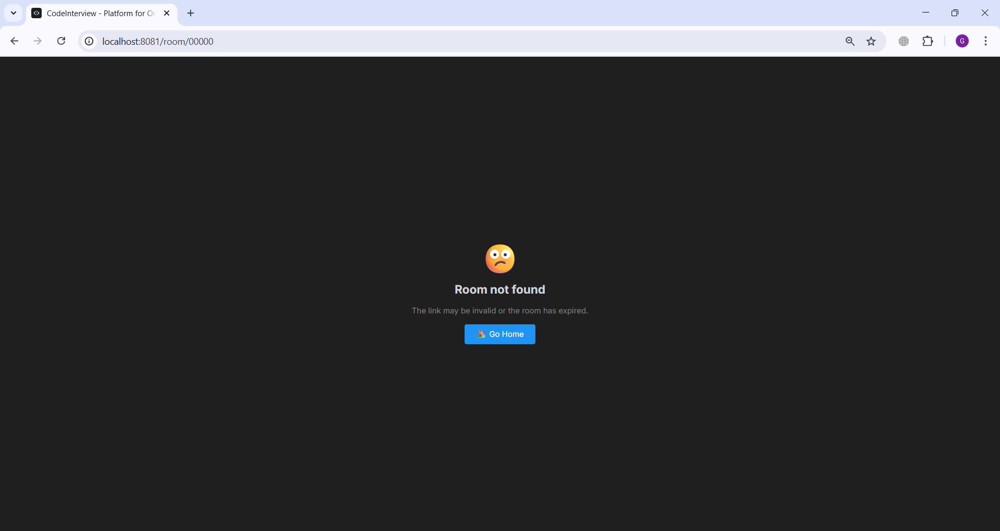
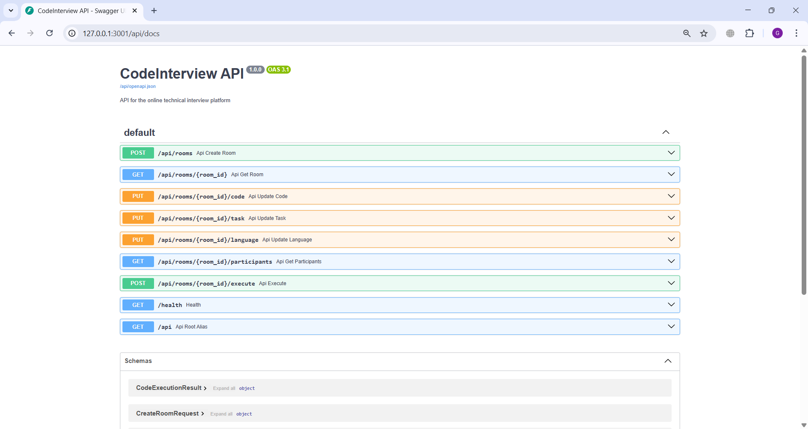
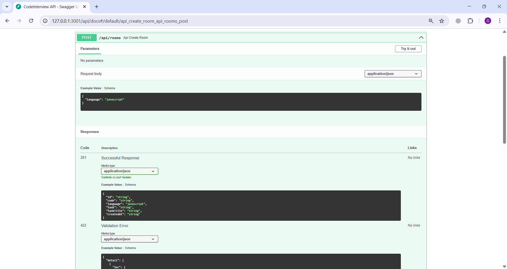
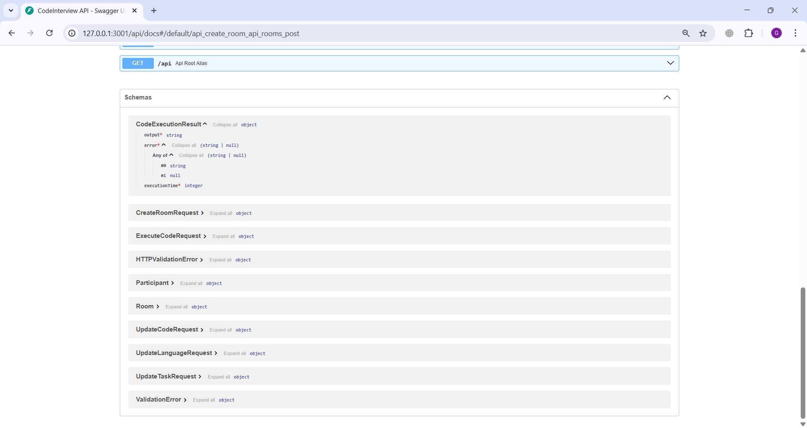

# Online Coding Interviews

**CodeInterview** is a full-featured platform for conducting real-time technical interviews. The application allows the interviewer and candidate to write code collaboratively, execute it directly in the browser, and communicate via chat.

The project implements a modern approach to online interviews, combining a code editor (IDE), a task library, and an execution environment into a single unified interface.

## Functionality Overview

### 1. Rooms & Collaboration
- **Instant Room Creation**: Any user can create a new room with a single click and get a unique link (`/room/:id`) to invite a candidate.
- **Real-Time Synchronization**: All code changes, language switching, and task selection are instantly reflected for all room participants (via WebSocket).
- **Participant List**: Real-time display of online users ("Guest", "Interviewer", etc.).
- **Built-in Chat**: Text chat for communication within the room without switching to external messengers.

### 2. Code Editor
- **Syntax Highlighting**: Full syntax highlighting for **JavaScript** and **Python** (powered by PrismJS).
- **Smart Editor**: Supports indentation, line numbering, and basic bracket auto-completion.
- **On-the-fly Language Switching**: Switching from JS to Python (and vice versa) preserves the context of the current task — the appropriate code template for the selected language is automatically loaded.

### 3. Secure Code Execution (Client-Side)
A key feature of the platform is that code runs **on the client (in the browser)**, reducing server load and ensuring security.
- **JavaScript**: Executes in an isolated **Web Worker**. `console.log` and errors are intercepted, preventing the main interface from freezing.
- **Python**: Executes via **Pyodide** (WebAssembly). This is a full-fledged Python interpreter inside the browser. We intercept `stdout` (print) and `stderr`, returning the result to the output console.

### 4. Task Library
- **Built-in Tasks**: A ready-to-use set of algorithmic tasks (Arrays, Strings, Algorithms) of varying difficulty (Easy, Medium, Hard).
- **Integration**: Selecting a task from the library automatically loads the problem description and starter code template into the editor.
- **Bilingual Support**: Each task has a version for both JS and Python.

### 5. Interface & UX
- **Dark & Light Theme**: Support for theme switching.
- **Responsive Design**: The interface works correctly on various screen resolutions.
- **Error Handling**: 404 page for invalid links, Toast notifications for events.

---


## Screenshots

### Frontend UI

<a href="docs/imgs/CodeInterview_Home.png" target="_blank">
  
</a>

<a href="docs/imgs/CodeInterview_Two-Users.png" target="_blank">
  
</a>

<a href="docs/imgs/CodeInterview_Task-Library.png" target="_blank">
  
</a>

<a href="docs/imgs/CodeInterview_404.png" target="_blank">
  
</a>

### Backend API (Swagger UI)

<a href="docs/imgs/CodeInterview-API_Swagger-UI_1.png" target="_blank">
  
</a>

<a href="docs/imgs/CodeInterview-API_Swagger-UI_2.png" target="_blank">
  
</a>
<a href="docs/imgs/CodeInterview-API_Swagger-UI_3.png" target="_blank">
  
</a>

## Technology Stack

### Frontend
- **React 18** + **Vite** (Fast, modern build tool)
- **TypeScript** (Type safety)
- **Shadcn UI** + **Tailwind CSS** (Modern, accessible components)
- **PrismJS** (Syntax highlighting)
- **Pyodide** (Python WASM interpreter)
- **Vitest** + **React Testing Library** (Unit & Component testing)

### Backend
- **FastAPI** (High-performance Python framework)
- **WebSocket** (Real-time communication)
- **SQLAlchemy** + **SQLite** (Room persistence)
- **OpenAPI** (API Specification)
- **Pytest** (Backend testing)

### DevOps & Infrastructure
- **Docker** & **Docker Compose** (Containerization)
- **GitHub Actions** (CI/CD pipeline)
- **Render** (Deployment configuration)

## Project Architecture

- **Frontend Routing**: `frontend/src/App.tsx` (React Router v7 future flags enabled)
- **Room Logic**: `frontend/src/hooks/useRoom.ts` (Manages WebSocket state, code sync, and execution)
- **Code Execution**: `frontend/src/utils/executor.ts` (Handles Web Worker & Pyodide)
- **Backend API**: `backend/app/api/routes.py` (REST endpoints)
- **Socket Manager**: `backend/app/main.py` (WebSocket connection handling)
- **Database Models**: `backend/app/models/database.py`

## Getting Started

### Option 1: Run with Docker Compose (Recommended)

Run both Frontend and Backend services simultaneously:

```bash
docker-compose up --build
```

- **Frontend**: http://localhost:8080
- **Backend**: http://localhost:3001

### Option 2: Run Locally with Concurrently

Run both services in a single terminal using `concurrently`:

```bash
# From the root directory
npm install
npm run dev
```

This will start:
- Backend on port 3001
- Frontend on port 8080

### Option 3: Run Locally (Separate Terminals)

#### Backend

```bash
cd backend
# Install dependencies (using pip or uv)
pip install fastapi uvicorn pydantic SQLAlchemy pytest

# Run server
uvicorn app.main:app --reload --port 3001
```

#### Frontend

```bash
cd frontend
# Install dependencies
npm install

# Run development server
npm run dev
```

## Testing

This project includes comprehensive testing for both client and server.

### Frontend Tests
Run unit and component tests using Vitest:

```bash
cd frontend
npm test
```

### Backend Tests
Run unit and integration tests using Pytest:

```bash
cd backend
pytest
```

Includes:
- **Unit Tests**: `backend/tests/`
- **Integration Tests**: `backend/tests_integration/` (API & WebSocket interactions)

## API Documentation

The backend provides a REST API and WebSocket endpoints.

### HTTP Endpoints

| Method | Endpoint | Description |
|--------|----------|-------------|
| `POST` | `/api/rooms` | Create a new room. Returns room ID and initial state. |
| `GET` | `/api/rooms/{roomId}` | Get room details (code, language, task). |
| `PUT` | `/api/rooms/{roomId}/code` | Update code in the room. |
| `PUT` | `/api/rooms/{roomId}/language` | Update programming language (`javascript`, `python`). |
| `PUT` | `/api/rooms/{roomId}/task` | Update task description and title. |
| `GET` | `/api/rooms/{roomId}/participants` | Get list of online participants. |
| `POST` | `/api/rooms/{roomId}/execute` | (Legacy) Server-side execution stub. |

### WebSocket API

URL: `ws://localhost:3001/ws/rooms/{roomId}`

Messages (JSON):
- **Join**: `{ "type": "join", "name": "User" }`
- **Code Update**: `{ "type": "code_update", "code": "..." }`
- **Language Update**: `{ "type": "language_update", "language": "python" }`
- **Task Update**: `{ "type": "task_update", "task": "...", "title": "..." }`
- **Chat**: `{ "type": "chat_message", "text": "Hello" }`
- **Output**: `{ "type": "output_update", "output": "..." }`

Full OpenAPI specification is available in `backend/openapi.yaml`.

## Deployment

### Deploy to Render (Cloud Application Platform)

This project is configured for seamless deployment on [**Render: Cloud Application Platform**](https://render.com).

1.  Fork or push this repository to your GitHub account.
2.  Create a new **Web Service** on Render.
3.  Connect your GitHub repository.
4.  Select **Docker** as the Runtime.
5.  (Optional) Use the `render.yaml` Blueprint:
    - Go to **Blueprints** in Render dashboard.
    - Click **New Blueprint Instance**.
    - Connect your repo — Render will automatically detect `render.yaml` and configure the service (Docker build, env vars, free plan).

**Manual Configuration (if not using Blueprint):**
- **Runtime**: Docker
- **Build Command**: (Automatic from Dockerfile)
- **Start Command**: (Automatic from Dockerfile)
- **Environment Variables**:
    - `FRONTEND_DIST_DIR`: `/app/frontend-dist` (Required for serving frontend static files)

The `Dockerfile` handles the multi-stage build:
1.  Compiles the React frontend (`npm run build`).
2.  Installs Python backend dependencies.
3.  Copies the built frontend to `/app/frontend-dist`.
4.  Starts `uvicorn` which serves both API (`/api`) and Frontend (`/`).

## CI/CD

Automated pipeline configured via GitHub Actions (`.github/workflows/ci.yml`):
1.  **Test**: Runs Frontend and Backend tests on every push/PR.
2.  **Build**: Verifies the Docker build process.

## Interactive Docs

- **Swagger UI**: http://localhost:3001/api/docs
- **ReDoc**: http://localhost:3001/api/redoc

## Acknowledgements

Thanks to [DataTalks.Club](https://github.com/DataTalksClub/ai-dev-tools-zoomcamp) for open-source learning framework


